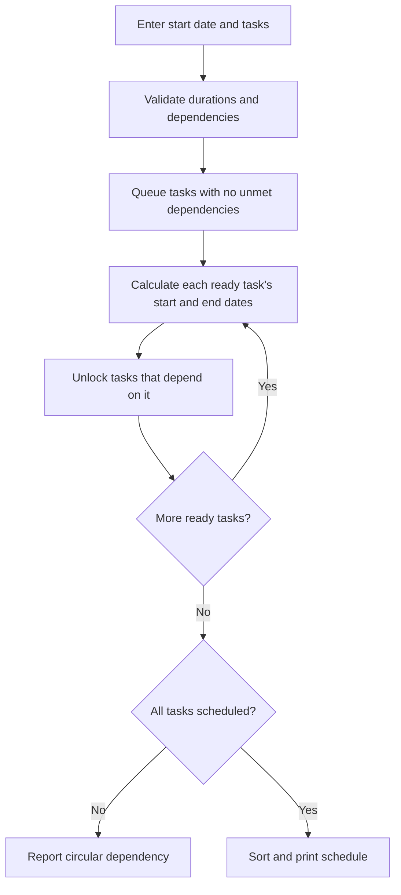

# Project Planner

A Java/Spring Boot console app that calculates start and end dates for project tasks.

## Run

Requires Java 17 or newer and Maven. From this folder:

The included Maven wrapper can be used instead of `mvn` (`.\mvnw.cmd` on Windows).

## Use the menu

1. Choose **1** and enter the project start date in `yyyy-MM-dd` format.
2. Choose **2** to add each task. Enter a name, duration in days, and dependency IDs separated by commas. Leave dependencies blank for none. Add prerequisite tasks first.
3. Choose **3** to view task IDs.
4. Choose **4** to edit a task. Leave a field blank to keep its value, or enter `-` for dependencies to clear them.
5. Choose **5** to generate the schedule.

Data is kept in memory while the app runs. Exiting clears it.

## Scheduling rules

- Durations count calendar days, including weekends and holidays.
- Start and end dates are inclusive. A 2-day task starting October 5 ends October 6.
- Tasks with no dependencies start on the project start date.
- A dependent task starts the day after its latest-finishing dependency.
- Independent tasks can run in parallel.
- Invalid task data or a circular dependency produces an error message.

Example with project start date `2026-10-05`:

| Task | Duration | Depends on | Start | End |
|---|---:|---|---|---|
| A | 2 | None | 2026-10-05 | 2026-10-06 |
| B | 3 | A | 2026-10-07 | 2026-10-09 |
| C | 1 | A | 2026-10-07 | 2026-10-07 |
| D | 2 | B, C | 2026-10-10 | 2026-10-11 |

`ScheduleServices` processes tasks in dependency order. If it cannot process all tasks, it reports a circular dependency.

## Flow



```text
ready = tasks with no dependencies
while ready is not empty:
    task = remove one ready task
    start = project start date, or the day after its latest dependency ends
    end = start + duration - 1 calendar day
    save task's start and end dates
    reduce unmet dependency counts of tasks depending on it
    add newly ready tasks to ready
if not every task was scheduled, report a cycle
print the schedule sorted by start date
```
